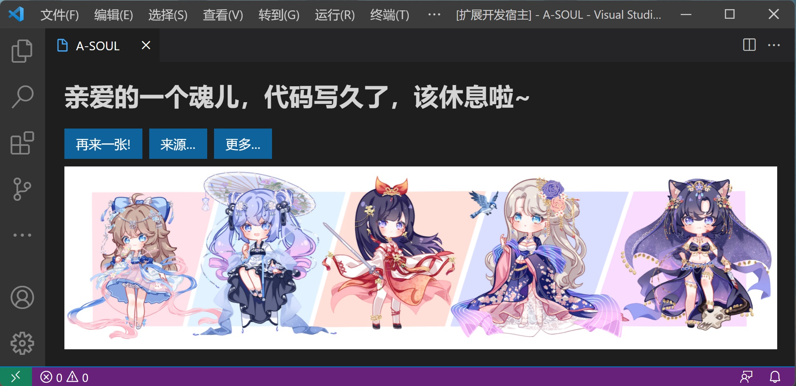

# A-SOUL鼓励师

在 VS Code 中连续写代码一小时（时间可配置），会有A-SOUL成员提醒你该休息啦~

Fork 自 [超越鼓励师](https://github.com/formulahendry/vscode-ycy)

注意：本程序包已适配 https://vscode.dev/, 欢迎直接在线体验。
（然而，由于B站图片不支持跨站访问，目前统一采用弹出新标签模式）

## 使用

除了每过一小时会自动弹出提醒页面，也可以按 `F1`, 然后输入 `asoul: 打开提醒页面`来打开提醒页面

(展示用图片来自[这里](https://t.bilibili.com/580623627884440502))

## 配置

* `asoul.reminderViewIntervalInMinutes`: 展示提醒页面的时间间隔（分钟）。(默认值为**60**)
* `asoul.title`: 提示文字。 (默认值为**亲爱的一个魂儿，代码写久了，该休息啦~**)
* `asoul.titleAva`, `asoul.titleBella`, `asoul.titleCarol`, `asoul.titleDiana`, `asoul.titleEileen`: 五位成员的专属提示文字。在图片的Tag唯一包含这位成员时，会优先显示这里设定的成员专属提示。
* `asoul.type`: 见下表所示

| 选项 | 名称 | 描述 |
| -- | -- | -- |
| url | 自定义图片 | 参见`asoul.customImages`的配置 |
| random | 二创 | 来自[这里](https://asoul.cloud/pic)的随机二创 |
| default | 官方图 | A-SOUL成员的官方海报 |
| niuniu | 牛牛鼓励师 | 勇敢牛牛，不怕困难！ |
| cao | 阿草鼓励师 | 狂暴鸿儒 |
| mix | 混合模式 | 90%概率弹出二创，5%概率弹出阿草，5%概率弹出勇敢牛牛|

* `asoul.customImages`: 配置自定义网图对应的图片数组（需要搭配asoul.type为url，可使用[imgurl](https://imgurl.org/)等图床上传自定义图片）
* `asoul.notification`: 是否打开防社死模式。在防社死模式下，每到设定的时间后，不会直接弹出图片窗口，而是会在右下角显示消息提醒（数秒后消失），手动点击后才会打开页面。(默认值为**true**)

## 二创画廊

本插件展示的所有二创作品均来自 [A-SOUL Fans Art - 一个魂的二创](https://asoul.cloud/pic) 的整理（同时，特别鸣谢网站方提供的API）。
所有图片的版权均归原作者所有。
可通过按 `F1`, 然后输入 `asoul: 打开二创画廊 (默认浏览器)`来打开此网站

## 友情链接

- [A-SOUL Fans Art - 一个魂的二创](https://asoul.cloud/pic)
- [VSCode插件：A-SOUL 提醒小助手](https://marketplace.visualstudio.com/items?itemName=JiangYan.asoul-notifications&ssr=false#overview)
- [IDEA插件：A-SOUL鼓励师](https://github.com/cnsky1103/A-SOUL-Reminder)
- [Windows 10/11 版提醒小助手](https://github.com/skykeyjoker/A-Soul-Notification)
- [Typora主题：Typora-theme-jiaran](https://github.com/q19980722/Typora-theme-jiaran)
